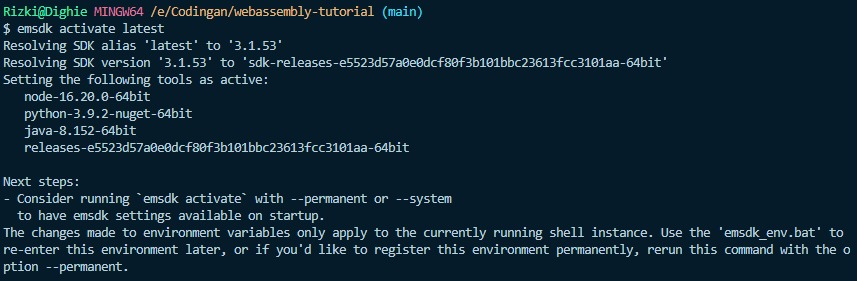
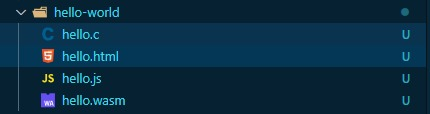
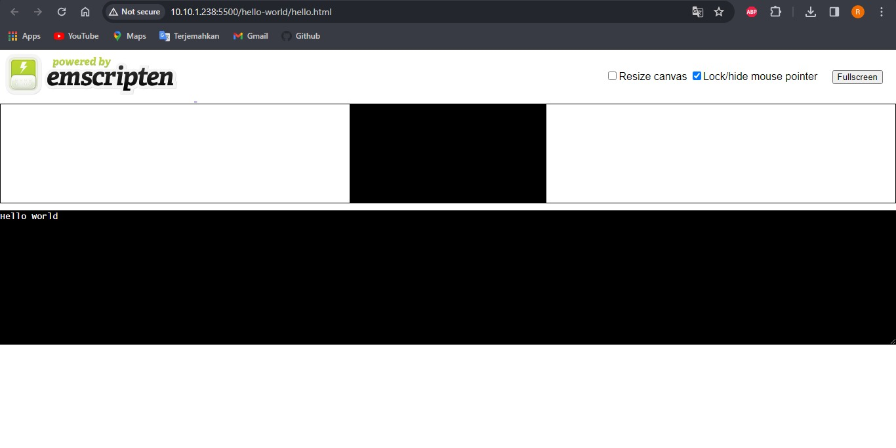

## Belajar WebAssembly


Program ini merupakan pembelajaran sederhana mengenai WebAssembly :

## Prasyarat 

1. Emscripten SDK yang digunakan untuk :
- Kompilasi ke Wasm dan membuat HTML untuk menjalankan kode kita, ditambah semua kode "lem" JavaScript yang diperlukan untuk menjalankan Wasm di lingkungan web.
- Kompilasi ke Wasm dan hanya membuat JavaScript.

2. C/C++ yang bisa di install di link berikut :

<a> https://code-visualstudio-com.translate.goog/docs/languages/cpp?_x_tr_sl=en&_x_tr_tl=id&_x_tr_hl=id&_x_tr_pto=tc</a>

## Instalasi

<a href="https://emscripten.org/docs/getting_started/downloads.html#sdk-download-and-install">Cara Instalasi Lengkap</a>

1. Jalankan perintah berikut di direktori tempat Anda ingin menyimpan library (contohnya C:\src sebagai jalur saya):

   ```bash
    cd $LibraryDirectory # ganti dengan directori sendiri
    git clone https://github.com/emscripten-core/emsdk.git
    cd emsdk
    ./emsdk install latest
    ./emsdk activate latest
   ```

2. Tambahkan $LibraryDirectory\emsdk ke variabel environment PATH
3. Mulai ulang terminal
4. Jalankan perintah emsdk --help untuk memastikan library telah terinstal dengan benar.

## Demo Program (Menampilkan "Hello World" ke web)
1. Pastikan semua requirement sudah di install
2. Kemudian buat sebuah folder untuk project masuk ke terminal dan activate terlebih dahulu untuk `emsdk` dengan command berikut :
  ```bash
  emsdk activate latest
  ```
  sehingga muncul berikut : 
  
3. Buat sebuah file dengan format `C` contoh `hello.c` dan masukan code berikut sebagai contoh:
  ```bash
    #include <stdio.h>
    
    int main() {
        printf("Hello World\n");
        return 0;
    }
  ```
3. Kemudian buka terminal dan jalan command berikut :
  ```bash
  emcc hello.c -o hello.html
  ```
4. Setelah command sebelumnya dijalankan maka akan generate beberapa file dalam folder tersebut :

    

6. Kemudian buka file html tersebut ke browser :

   

